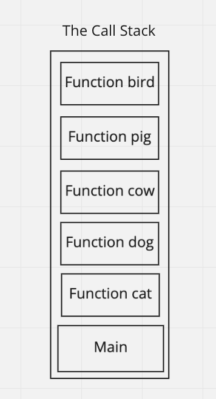

# In Memory Storage

This is relevant for understanding recursion, functional progarmming, and computer science more broadly. Also, debugging is a fundamental programming skill that is always relevant as well.

## Understanding the JavaScript Call Stack

Source: [The JavaScript Call Stack - What It Is and Why It's Necessary](https://www.freecodecamp.org/news/understanding-the-javascript-call-stack-861e41ae61d4)

### What is a ‘call’?

A call is another term for a function invokation. A function invokation/call creates a frame on the call stack with an execution context for the function to execute in, and then executes the called/invoked function within that execution context/stack frame within stack memory.

### How many ‘calls’ can happen at once?

Only one function is called at a time, and only one function has the control flow of the executing thread at any given time (for a single-threaded application). However, function calls can be nested, such that a function is called from another function before the calling function is returned, and this can be nested thousands of times. This is what recursion does. This can continue up until the limit of the runtime environment that is executing the code, before it will throw a stack overflow error.

### What does LIFO mean?

Last-In-First-Out. This is in contrast with a queue, which is FIFO or First-In-First-Out, which is how people stand in line waiting for something.

### Draw an example of a call stack and the functions that would need to be invoked to generate that call stack.



```
cat();

function cat() {
  dog();
}

function dog() {
  cow();
}

function cow() {
  pig();
}

function pig() {
  pig();
}

function bird() {
  return 'This is the end of this call stack example';
}
```

### What causes a Stack Overflow?

Every runtime environment puts a max limit for the number of frames that can be on the call stack before it will throw and error and stop the execution of the program. When this limit is exceeded, a stack overflow is the type of error that is thrown.

## JavaScript Error Messages

Source: [JavaScript error messages && debugging](https://codeburst.io/javascript-error-messages-debugging-d23f84f0ae7c)

### What is a ‘reference error’?

When you access memory for something that is not declared or defined yet. For example, accessing (reading from or writing to) an undeclared variable.

### What is a ‘syntax error’?

This means that the code is written incorrectly such that it cannot be parsed correctly by the compiler or interpreter. This further means that the code cannot be executed, so it does not even get run at all.

### What is a ‘range error’?

Giving an object with a length property an invalid length. For example, giving an array a negative length.

### What is a ‘type error’?

This is caused by trying to read from or write to the wrong data type. For example, if you tried to use an array method called from any other data type that is not an array.

### What is a breakpoint?

This is a feature of a debugger, which halts the execution of the code at a specific line in the code where the breakpoint is set.

### What does the word ‘debugger’ do in your code?

It adds a breakpoint on that line of code.

## Things I want to know more about
